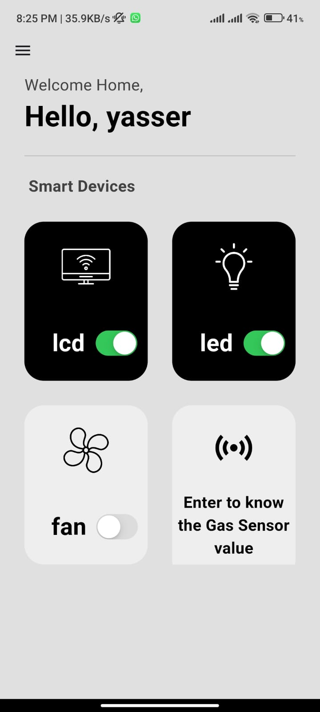

# 🔐 IoT_SEC

A real-time IoT smart home safety system that detects dangerous gas leakage levels and automatically controls connected home devices using Flutter, Firebase, and ESP32.

---

# 📱 Application Preview

<p align="center">
  
</p>

---

# 🚨 Problem

Gas leakage is one of the most dangerous problems inside smart homes and can cause fires, explosions, or serious health risks.

Traditional alarm systems only notify the user without taking immediate action.

IoT_SEC was built to solve this issue using:
- Real-time monitoring
- Smart automation
- Remote control
- Instant emergency response

---

# 💡 Solution

The system continuously monitors gas levels using IoT sensors connected to ESP32/Arduino boards.

When the gas value exceeds the safety threshold:
- Emergency mode is activated
- Connected devices are turned OFF automatically
- Sensor data updates instantly in the app
- The user can monitor the situation remotely

---

# ✨ Features

- 🔐 User Authentication
- ☁️ Firebase Integration
- 📡 Real-time Sensor Monitoring
- 🏠 Smart Device Control
- ⚡ Automatic Emergency Shutdown
- 📲 Remote Device Management
- 🚨 Gas Leakage Detection
- 📊 Live Data Synchronization
- 🎛️ Interactive Dashboard UI

---

# 🛠️ Technologies Used

## 📱 Mobile Application
- Flutter
- Dart

## ☁️ Backend & Cloud
- Firebase Authentication
- Firebase Realtime Database
- Cloud Firestore

## 🔌 IoT Hardware
- ESP32 / Arduino
- MQ Gas Sensor
- Relay Modules

---

# 🔄 System Architecture

```text
Gas Sensor
   ↓
ESP32 / Arduino
   ↓
Firebase Realtime Database
   ↓
Flutter Mobile App
   ↓
Emergency Actions & Device Control
```

---

# 📸 Screenshots

## 🔑 Login Screen

Secure login screen for accessing the system.

<p align="center">
  
</p>

---

## 🏠 Smart Home Dashboard

Control and monitor smart devices in real-time.

Features:
- LCD Control
- LED Control
- Fan Control
- Live Device Status

<p align="center">
  
</p>

---

## ⛽ Gas Sensor Monitoring

Live gas sensor values displayed using a dynamic gauge meter.

### Reading Levels
- 🟢 Safe
- 🟠 Warning
- 🔴 Dangerous

<p align="center">
  
</p>

---

# 🧠 Emergency Scenario

### Example Workflow

1. Gas leakage happens
2. Sensor detects abnormal gas level
3. ESP32 sends data to Firebase
4. Flutter app receives live update
5. Emergency mode activates
6. Connected devices shut down automatically
7. User monitors status remotely

---

# 📂 Project Structure

```bash
lib/
│
├── models/
├── screens/
├── services/
├── widgets/
├── firebase/
└── main.dart
```

---

# 🚀 Getting Started

## Clone Repository

```bash
git clone https://github.com/MohamedHany1512/IOT_SEC.git
```

---

## Install Dependencies

```bash
flutter pub get
```

---

## Run Application

```bash
flutter run
```

---

# 🔥 Firebase Configuration

Add Firebase configuration files:

## Android
```bash
android/app/google-services.json
```

## iOS
```bash
ios/Runner/GoogleService-Info.plist
```

Enable:
- Authentication
- Realtime Database
- Firestore

---

# 🎯 Future Improvements

- 📲 Push Notifications
- 🤖 AI-based Risk Prediction
- 📷 Smart Camera Integration
- 🎙️ Voice Assistant Support
- 🏠 Multi-room Monitoring
- 📈 Analytics Dashboard

---

# 👨‍💻 Developer

## Mohamed Hany

Flutter Developer specialized in:
- Flutter & Firebase
- IoT Applications
- Smart Systems
- Real-time Applications

### GitHub
https://github.com/MohamedHany1512

---

# ⭐ Support

If you found this project useful, give it a star ⭐ on GitHub.
